ДЗ 2 Шавронская Визуализация
================
Шавронская Дарья Олеговна
2022-10-23

``` r
#install.packages(c("dplyr", "ggplot2"))
library(dplyr)
```

    ## 
    ## Attaching package: 'dplyr'

    ## The following objects are masked from 'package:stats':
    ## 
    ##     filter, lag

    ## The following objects are masked from 'package:base':
    ## 
    ##     intersect, setdiff, setequal, union

``` r
library(ggplot2)
library(plotly)
```

    ## 
    ## Attaching package: 'plotly'

    ## The following object is masked from 'package:ggplot2':
    ## 
    ##     last_plot

    ## The following object is masked from 'package:stats':
    ## 
    ##     filter

    ## The following object is masked from 'package:graphics':
    ## 
    ##     layout

``` r
library(corrplot)
```

    ## corrplot 0.92 loaded

1 Загрузите датасет insurance_cost.csv

``` r
insurance_cost <- read.csv('insurance_cost.csv', stringsAsFactors = T)
```

2 Сделайте интерактивный plotly график отношения индекса массы тела и трат
на страховку. Раскрасьте его по колонке smoker

``` r
plot_ly(data = insurance_cost[(insurance_cost$bmi != 0) & (insurance_cost$charges != 0),],
        x = ~ bmi,
        y = ~ charges,
        color = ~ smoker, 
        colors = c("#FF4500", "#4682B4"), 
        alpha = 0.5
)%>% 
layout(
    title = 'Ratio of BMI and charges',
    yaxis = list(title = 'Charges',
                 zeroline = FALSE),
    xaxis = list(title = 'BMI',
                 zeroline = FALSE),
    legend = list (title = list(text='smoker'))
)
```

3 Сделайте тоже самое через ggplotly3

``` r
scatter_bmi <- ggplot() + 
  geom_point(data = insurance_cost, aes(x=bmi, y=charges, color=smoker), alpha = 0.5) +
  labs(y = "Charges", x = "BMI") +
  ggtitle("Ratio of BMI and charges") +
  scale_color_manual(values = c("#FF4500", "#4682B4")) + 
  theme_minimal() +
  theme (
    plot.title = element_text(hjust = 0.5)
  )
ggplotly(scatter_bmi)
```

4 Кратко сделайте корреляционный анализ данных insurance_cost.
Посмотрите документацию пакетов, которые мы проходили на занятии и,
исходя из этого, постройте минимум два новых типа графика (которые мы не
строили на занятии)

``` r
insurance_cost_clear <- insurance_cost %>%
  select(is.integer | is.numeric)
```

    ## Warning: Use of bare predicate functions was deprecated in tidyselect 1.1.0.
    ## ℹ Please use wrap predicates in `where()` instead.
    ##   # Was:
    ##   data %>% select(is.integer)
    ## 
    ##   # Now:
    ##   data %>% select(where(is.integer))

    ## Warning: Use of bare predicate functions was deprecated in tidyselect 1.1.0.
    ## ℹ Please use wrap predicates in `where()` instead.
    ##   # Was:
    ##   data %>% select(is.numeric)
    ## 
    ##   # Now:
    ##   data %>% select(where(is.numeric))

``` r
insurance_cost_cor <- cor(insurance_cost_clear)
insurance_cost_cor
```

    ##                age   children       bmi    charges
    ## age      1.0000000 0.04246900 0.1092719 0.29900819
    ## children 0.0424690 1.00000000 0.0127589 0.06799823
    ## bmi      0.1092719 0.01275890 1.0000000 0.19834097
    ## charges  0.2990082 0.06799823 0.1983410 1.00000000

\ corrgram

``` r
#install.packages("corrgram")
library(corrgram)

corrgram(insurance_cost_cor,
         order = TRUE,             
         upper.panel = panel.pie,  
         lower.panel = panel.shade,
         text.panel = panel.txt) 
```

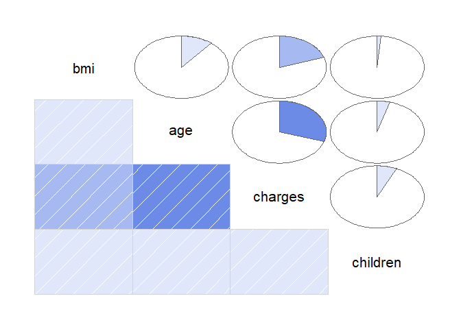<!-- -->
\ corrplot

``` r
corrplot(insurance_cost_cor, method = 'color', diag = FALSE, order = 'alphabet', type = 'upper')
```

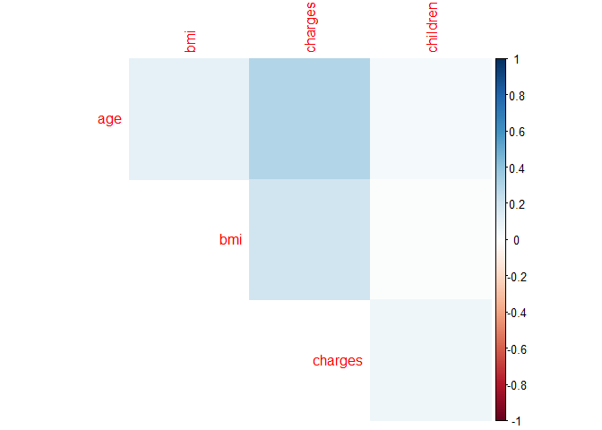<!-- -->

``` r
corrplot(insurance_cost_cor, method = 'pie', diag = FALSE)
```

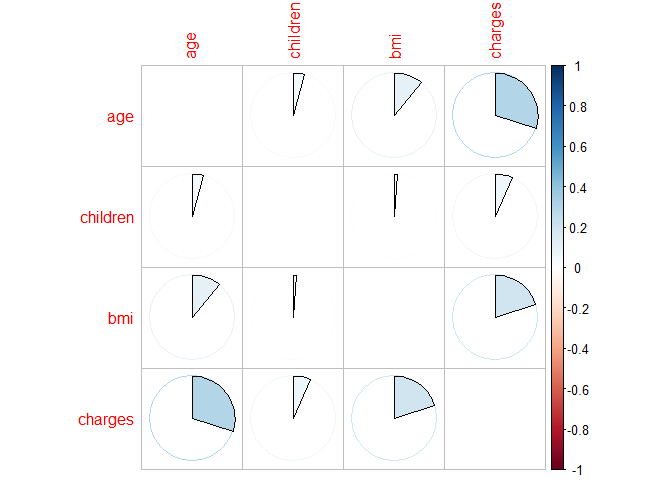<!-- -->

\ pairs <https://r-coder.com/correlation-plot-r/>

``` r
panel.cor <- function(x, y, digits = 2, prefix = "", cex.cor, ...) {
    usr <- par("usr")
    on.exit(par(usr))
    par(usr = c(0, 1, 0, 1))
    Cor <- abs(cor(x, y))
    txt <- paste0(prefix, format(c(Cor, 0.123456789), digits = digits)[1])
    if(missing(cex.cor)) {
        cex.cor <- 0.4 / strwidth(txt)
    }
    text(0.5, 0.5, txt,
         cex = 1 + cex.cor * Cor)
}
panel.hist <- function(x, ...) {
    usr <- par("usr")
    on.exit(par(usr))
    par(usr = c(usr[1:2], 0, 1.5))
    his <- hist(x, plot = FALSE)
    breaks <- his$breaks
    nB <- length(breaks)
    y <- his$counts
    y <- y/max(y)
    rect(breaks[-nB], 0, breaks[-1], y, col = "#4BD76C", ...)
}
panel.dot <- function(x,y){
    points(x,y,pch=18, col="#4BD76C", aplha = 0.5)
}
pairs(insurance_cost_clear, 
      upper.panel = panel.cor, 
      diag.panel = panel.hist,
      lower.panel = panel.dot)
```

    ## Warning in par(usr): argument 1 does not name a graphical parameter

    ## Warning in plot.xy(xy.coords(x, y), type = type, ...): "aplha" is not a
    ## graphical parameter

    ## Warning in plot.xy(xy.coords(x, y), type = type, ...): "aplha" is not a
    ## graphical parameter

    ## Warning in plot.xy(xy.coords(x, y), type = type, ...): "aplha" is not a
    ## graphical parameter

    ## Warning in par(usr): argument 1 does not name a graphical parameter

    ## Warning in par(usr): argument 1 does not name a graphical parameter

    ## Warning in plot.xy(xy.coords(x, y), type = type, ...): "aplha" is not a
    ## graphical parameter

    ## Warning in plot.xy(xy.coords(x, y), type = type, ...): "aplha" is not a
    ## graphical parameter

    ## Warning in par(usr): argument 1 does not name a graphical parameter

    ## Warning in par(usr): argument 1 does not name a graphical parameter

    ## Warning in par(usr): argument 1 does not name a graphical parameter

    ## Warning in plot.xy(xy.coords(x, y), type = type, ...): "aplha" is not a
    ## graphical parameter

    ## Warning in par(usr): argument 1 does not name a graphical parameter

    ## Warning in par(usr): argument 1 does not name a graphical parameter

    ## Warning in par(usr): argument 1 does not name a graphical parameter

    ## Warning in par(usr): argument 1 does not name a graphical parameter

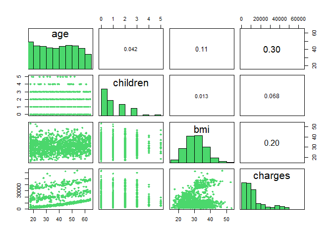<!-- -->

5 Превратите все номинативные переменные в бинарные/дамми. Т.е. sex и
smoker должны стать бинарными (1/0), а каждое уникальное значение region
– отдельной колонкой, где 1 говорит о наличии этого признака для
наблюдения, а 0 – об отсутствии. Создайте новый датафрейм, где вы
оставите только нумерические переменные.

``` r
insurance_cost_num <- insurance_cost %>%
  mutate(male = as.numeric(sex =="male"),
         smoker = as.numeric (smoker == "yes"),
         southwest = as.numeric(region == "southwest"),
         northwest = as.numeric(region == "northwest"),
         northeast = as.numeric(region == "northeast"),
         southeast = as.numeric(region == "southeast")) %>%
  select(age, male, bmi, children, smoker, southwest, northwest, northeast, southeast, charges)
```

6 Постройте иерархическую кластеризацию на этом датафрейме

``` r
library(factoextra)
```

    ## Welcome! Want to learn more? See two factoextra-related books at https://goo.gl/ve3WBa

``` r
insurance_num_cost_scaled <- scale(insurance_cost_num)
insurance_num__cost_dist <- dist(insurance_num_cost_scaled, method = "euclidean")
hc1 <- hclust(d = insurance_num__cost_dist, 
                        method = "ward.D2")
fviz_dend(hc1, 
          cex = 0.5)
```

    ## Warning: `guides(<scale> = FALSE)` is deprecated. Please use `guides(<scale> =
    ## "none")` instead.

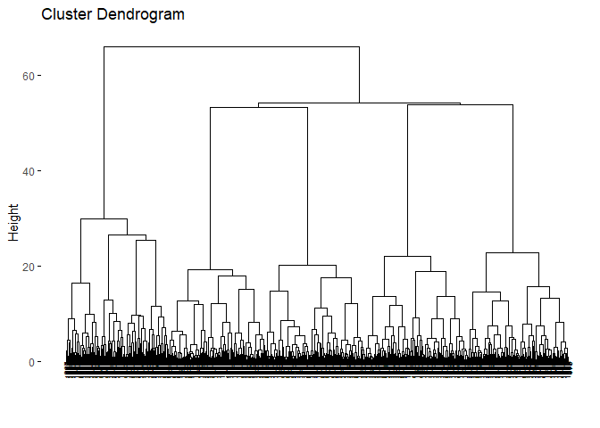<!-- -->

7 Используя документацию или предложенный учебник сделайте ещё несколько
возможных графиков по иерархической кластеризации. Попробуйте раскрасить
кластеры разными цветами

``` r
fviz_dend(hc1, k = 5, 
          cex = 0.5,
          k_colors = c("#2E9FDF", "#00AFBB", "#E7B800", "#FC4E07", "#CC235B"),
          color_labels_by_k = TRUE,
          rect = TRUE)
```

    ## Warning: `guides(<scale> = FALSE)` is deprecated. Please use `guides(<scale> =
    ## "none")` instead.

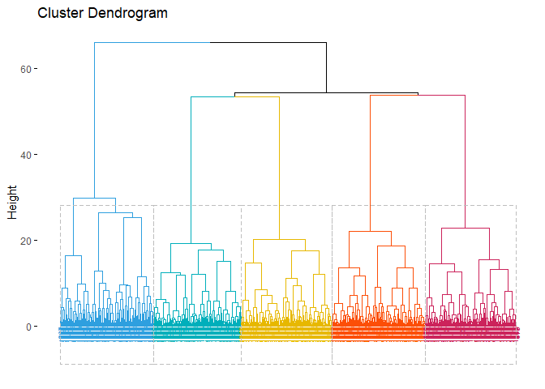<!-- -->

``` r
hc2 <- hclust(d = insurance_num__cost_dist, 
                        method = "single")
fviz_dend(hc2, k = 4, 
          cex = 0.5,
          k_colors = c("#2E9FDF", "#00AFBB", "#E7B800", "#FC4E07"),
          color_labels_by_k = TRUE,
          rect = TRUE
)
```

    ## Warning: `guides(<scale> = FALSE)` is deprecated. Please use `guides(<scale> =
    ## "none")` instead.

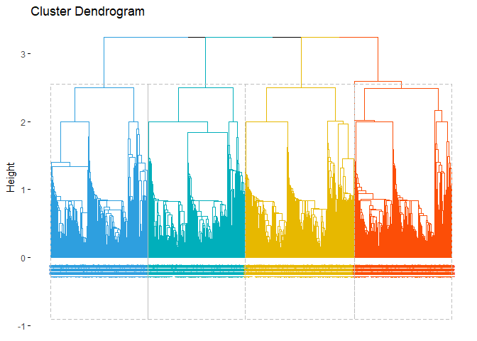<!-- -->

``` r
hc3 <- hclust(d = insurance_num__cost_dist, 
                        method = "complete")
fviz_dend(hc3, k = 5, 
          cex = 0.5,
          k_colors = c("#2E9FDF", "#00AFBB", "#E7B800", "#FC4E07", "#CC235B"),
          type = "circular")
```

    ## Warning: `guides(<scale> = FALSE)` is deprecated. Please use `guides(<scale> =
    ## "none")` instead.

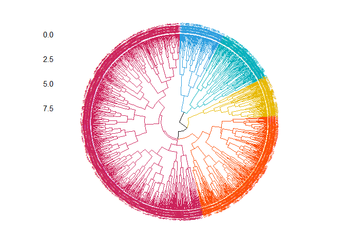<!-- -->

``` r
insurance_cost_grp <- cutree(hc3, k = 5)
fviz_cluster(list(data = insurance_cost_num, cluster = insurance_cost_grp),
            ellipse.type = "convex", 
            repel = TRUE,
            show.clust.cent = FALSE, 
            ggtheme = theme_minimal()
            )
```

    ## Warning: ggrepel: 1307 unlabeled data points (too many overlaps). Consider
    ## increasing max.overlaps

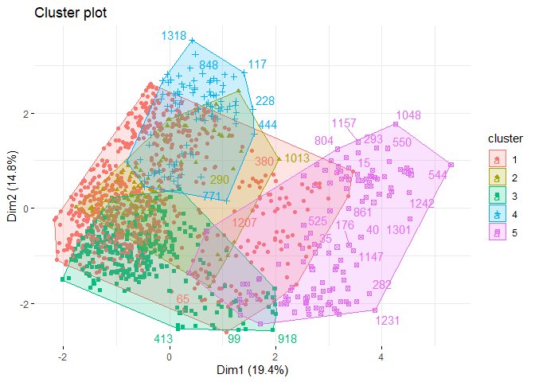<!-- -->

8 Сделайте одновременный график heatmap и иерархической кластеризации

``` r
library(pheatmap)
```

``` r
pheatmap(insurance_num_cost_scaled,
         cutree_cols = 10,
        clustering_method = "ward.D2")
```

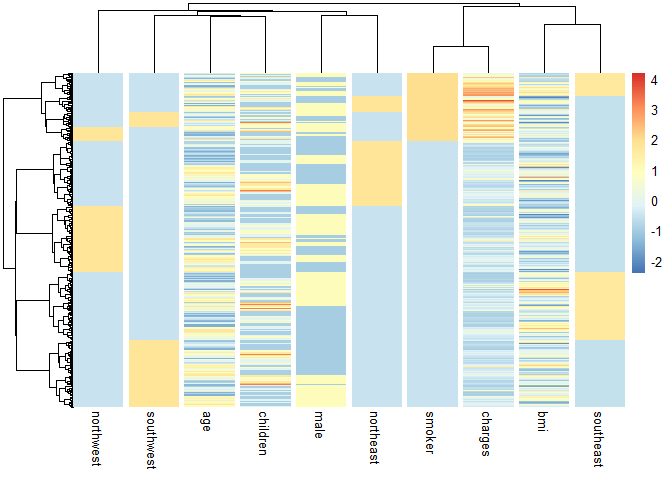<!-- -->

9 Проведите анализ данных полученных в задании 5 методом PCA. Кратко
проинтерпретируйте полученные результаты.

``` r
insurance_cost_pca <- prcomp(insurance_cost_num, scale = TRUE)
summary(insurance_cost_pca)
```

    ## Importance of components:
    ##                           PC1    PC2    PC3    PC4    PC5    PC6    PC7     PC8
    ## Standard deviation     1.3939 1.2182 1.1510 1.1496 1.0403 1.0018 0.9767 0.86822
    ## Proportion of Variance 0.1943 0.1484 0.1325 0.1321 0.1082 0.1004 0.0954 0.07538
    ## Cumulative Proportion  0.1943 0.3427 0.4752 0.6073 0.7156 0.8159 0.9113 0.98669
    ##                            PC9      PC10
    ## Standard deviation     0.36478 1.555e-15
    ## Proportion of Variance 0.01331 0.000e+00
    ## Cumulative Proportion  1.00000 1.000e+00

Первые 4 главные компоненты объясняют 61% вариации данных

``` r
fviz_eig(insurance_cost_pca, 
         addlabels = T, 
         ylim = c(0, 40))
```

<!-- -->

``` r
fviz_pca_var(insurance_cost_pca, col.var = "contrib") +
  labs(color = "Contribution", x = "PC1", y = "PC2")
```

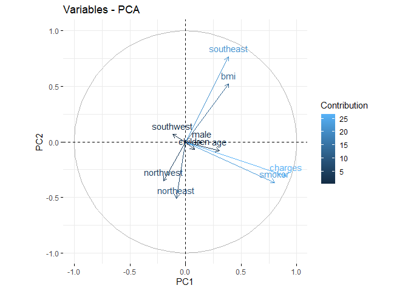<!-- -->

``` r
fviz_pca_var(insurance_cost_pca, 
             select.var = list(contrib = 6), 
             col.var = "contrib") +
  labs(color = "Contribution", x = "PC1", y = "PC2")
```

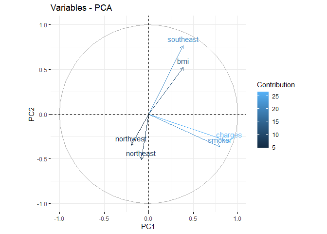<!-- --> -
Стрелки - средние значения переменных для PC1 и PC2. В скобках указаны
проценты объяснённой дисперсии каждой из двух компонент. На каждую
последующую PC всегда приходится всё меньше и меньше разброса в
данных. - Цвет и близость к кругу - насколько та или иная переменная
вносит вклад в анализируемые главные компоненты - Направление -
относительная мера близости переменных. Если стрелки расходятся в
прямо-противоположные стороны, то переменные отрицательно скоррелированы
внутри представленных главных компонент.

Smoker, charges позитивая корреляция с 1 главной компонентой Southeast,
bmi позитивня корреляция со 2 главной компонентой

Посмотрим из чего состоят 1 и 2 компоненты:

``` r
fviz_contrib(insurance_cost_pca, choice = "var", axes = 1, top = 24, 
             title = "Contribution of variables to PC1")
```

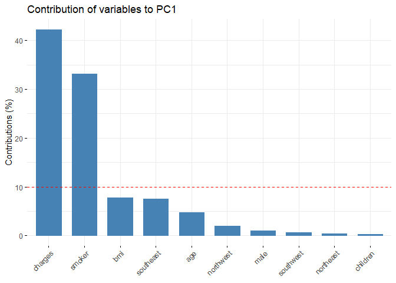<!-- -->

``` r
fviz_contrib(insurance_cost_pca, choice = "var", axes = 2, top = 24,
             title = "Contribution of variables to PC2")
```

<!-- -->

``` r
fviz_pca_ind(insurance_cost_pca, label = "none", alpha = 0.5) + 
  labs(x = "PC1", y = "PC2")
```

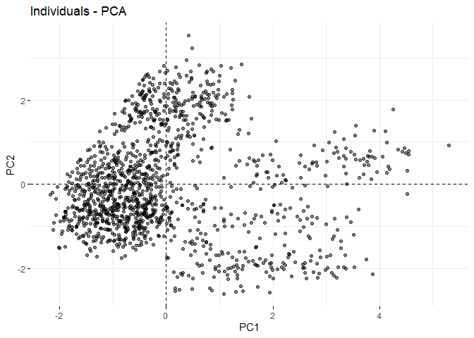<!-- -->

10 В финале вы получите график PCA по наблюдениям и переменным. Сделайте
кластеризацию данных на нём по возрастным группам (создайте их сами на
ваш вкус, но их количество должно быть не меньше 3).

``` r
age_is <- insurance_cost %>%
  mutate( 
    age_group = case_when(
      age < 35 ~ "age: <35",
      age >= 35 & age < 50 ~ "age: 35-49",
      age >= 50 ~ "age: 50+"
    ))

fviz_pca_ind(insurance_cost_pca, label = "none",
             pointsize = 2, pointshape = 20, alpha = 0.5, 
             habillage = age_is$age_group) + 
  labs(x = "PC1", y = "PC2") +
  theme_minimal()
```

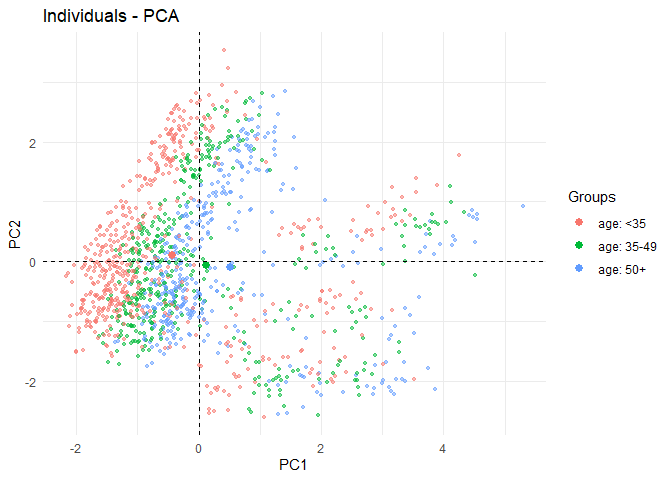<!-- -->

11 Подумайте и создайте ещё две номинативные переменные, которые бы
гипотетически могли хорошо разбить данные на кластеры. Сделайте две
соответствующие визуализации.

``` r
charges_is <- insurance_cost %>%
  mutate( 
    charges_group = case_when(
      charges < 40000  ~ "charges < 40K",
      charges >= 40000 ~ "charges >= 40K"
    ))

fviz_pca_ind(insurance_cost_pca, label = "none",
             pointsize = 2, pointshape = 20, alpha = 0.5, 
             habillage = charges_is$charges_group, 
             addEllipses=TRUE) + 
  labs(x = "PC1", y = "PC2") +
  theme_minimal()
```

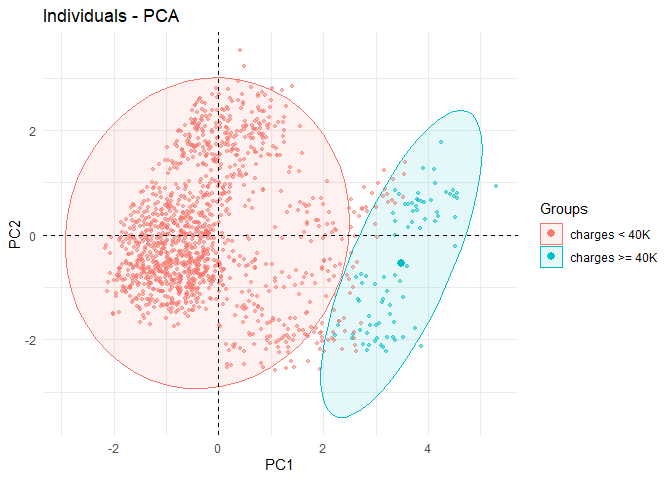<!-- -->

``` r
group_is <- insurance_cost %>%
  mutate( 
    sm_group = case_when(
       bmi >= 40 ~ "bmi >= 40",
       bmi < 40 ~ "bmi < 40"
    ))

fviz_pca_ind(insurance_cost_pca, label = "none",
             pointsize = 2, pointshape = 20, alpha = 0.5, 
             habillage = group_is$sm_group, 
             addEllipses=TRUE) + 
  labs(x = "PC1", y = "PC2") +
  theme_minimal()
```

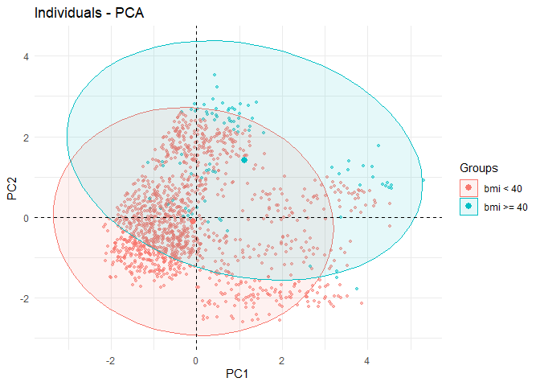<!-- -->

12 Давайте самостоятельно увидим, что снижение размерности – это группа
методов, славящаяся своей неустойчивостью. Попробуйте самостоятельно
поизменять дафрейм – удалить какие-либо переменные или создать их
(создавайте только дамми переменные).

``` r
insurance_cost_num_m<- insurance_cost_num %>%
  select(male, bmi, children, smoker, northeast, charges)
insurance_cost_pca_m <- prcomp(insurance_cost_num_m, center = TRUE, scale. = TRUE)
fviz_pca_var(insurance_cost_pca_m, col.var = "contrib") +
  labs(color = "Contribution", x = "PC1", y = "PC2")
```

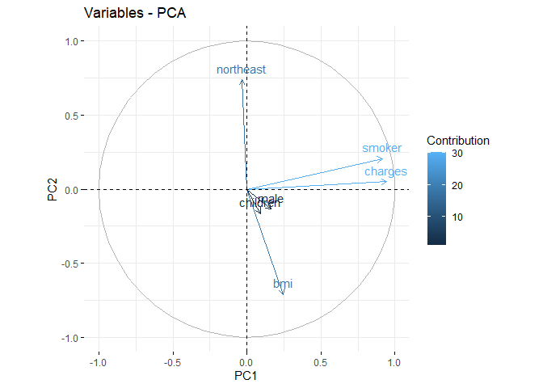<!-- -->
